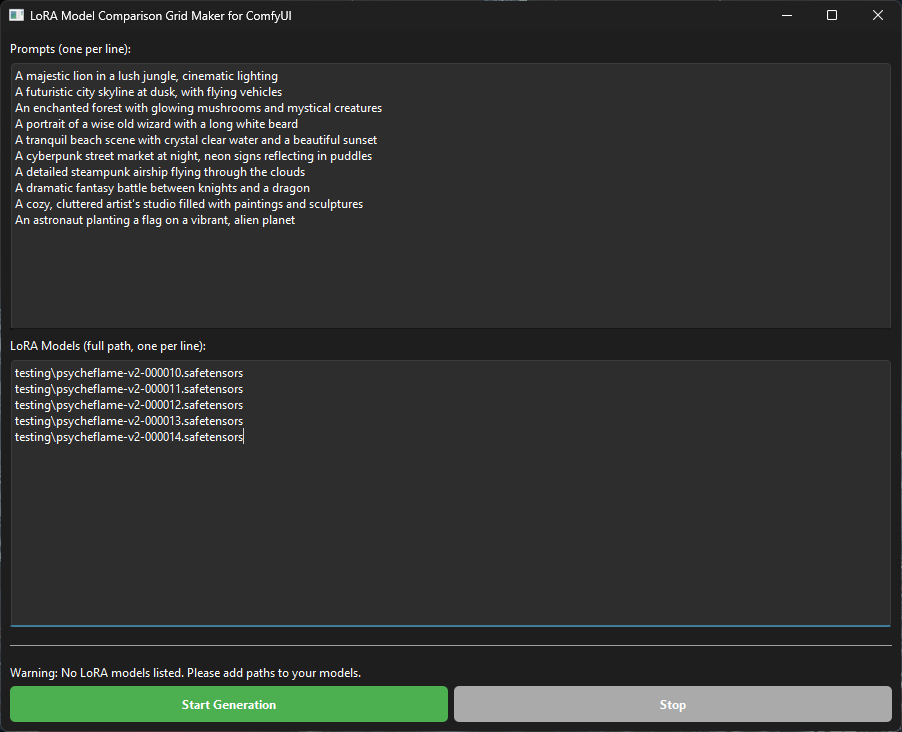

# LoRA Model Comparison Tools for ComfyUI


This repository contains two Python scripts designed to help you compare and evaluate different LoRA (Low-Rank Adaptation) models within the ComfyUI image generation platform. These tools automate the process of generating images with multiple LoRAs and prompts, making it easier to see how each LoRA affects the output.

The tools are built using Python and the PySide6 library for the user interface. They interact with a running ComfyUI instance through its API.

---
## Included Files

* `lora_voter.py`: A graphical application that allows you to conduct a blind A/B test between two or more LoRA models. It presents you with images generated from the same prompt and seed across different LoRAs, and you vote for the one that best fits the prompt.
* `grid_maker.py`: A script that generates a comparison grid of images. It systematically creates an image for each combination of a given prompt and LoRA model, using a consistent seed for each prompt row. This is useful for direct, side-by-side comparisons.
* `flux_dev_example_with_upscale.json`: An example ComfyUI workflow that is used by both scripts. This workflow is pre-configured and does not need to be modified.

---
## How They Work

Both scripts operate by programmatically controlling a ComfyUI instance. They take the base workflow (`flux_dev_example_with_upscale.json`), and for each image they need to generate, they modify the workflow in memory to:

1.  Set the desired LoRA model in the `LoraLoader` node.
2.  Insert the prompt into the `CLIPTextEncode` node.
3.  Assign a random seed that remains consistent for each prompt across all LoRAs.

The modified workflow is then queued to the ComfyUI server. The scripts wait for the generation to complete, retrieve the resulting image, and then display it in the user interface.

---
## Requirements

* **Python 3**: The scripts are written in Python and require it to run.
* **PySide6**: A Python library for creating graphical user interfaces. You can install it by running:
    ```bash
    pip install PySide6
    ```
* **Websocket-client**: A library for WebSocket communication, used to get real-time feedback from ComfyUI. Install it with:
    ```bash
    pip install websocket-client
    ```
* **Running ComfyUI Instance**: Both scripts need to connect to a running ComfyUI server. By default, they assume the server is at `127.0.0.1:8188`.

---
## Setup

1.  **Place Files**: Place the `lora_voter.py`, `grid_maker.py`, and `flux_dev_example_with_upscale.json` files together in the same folder.
2.  **Install LoRAs**: Make sure all the LoRA models (`.safetensors` files) you want to test are located inside your `ComfyUI/models/loras/` directory. You can organize them into subfolders if you wish.
3.  **Run ComfyUI**: Start your ComfyUI server and ensure it is running before launching either script.

---
## LoRA Voter (`lora_voter.py`)

The LoRA Voter is an interactive tool for ranking your LoRA models based on a series of head-to-head comparisons.

### How to Use

1.  **Run the script**:
    ```bash
    python lora_voter.py
    ```
2.  **Add LoRA Models**: In the main window, use the text fields to enter the names of the LoRA models you want to compare.
    * If the LoRA is in the root `loras` folder, just type its name (e.g., `my_awesome_lora.safetensors`).
    * If it's in a subfolder, include the relative path (e.g., `testing\style_lora.safetensors` or `characters/my_character.safetensors`).
    * Use the **+ Add Another LoRA Model** button to add more fields. You need at least two LoRAs to start.
3.  **Start the Session**: Click the **Start Voting Session** button.
4.  **Generate and Wait**: The application will now connect to ComfyUI and start generating the images for the first round. The UI will show a "Loading" message.
5.  **Vote**: Once the images are ready, they will be displayed in a shuffled order. Click on the image that you think best represents the prompt shown on the left panel.
6.  **Continue**: As soon as you vote, the application records your choice, clears the grid, and automatically starts the next round with a new prompt.
7.  **View Scores**: After 10 rounds, a message box will appear with the final scores for each LoRA model.

---
## Grid Maker (`grid_maker.py`)

The Grid Maker is a utility for creating a comprehensive visual comparison sheet of your LoRA models.

### How to Use

1.  **Run the script**:
    ```bash
    python grid_maker.py
    ```
2.  **Add Prompts and Models**: The UI has two text boxes.
    * In the **Prompts** box, you can add, edit, or remove the prompts you want to test (one per line).
    * In the **LoRA Models** box, enter the names of the LoRA models you want to include in the grid, one per line. Just like the Voter app, you can specify subfolders (e.g., `testing\my_lora.safetensors`).
3.  **Start Generation**: Click the **Start Generation** button.
4.  **Monitor Progress**: The progress bar and status label will keep you updated on the generation process. Each row of the grid will use the same seed for all LoRAs.
5.  **Generation Complete**: Once all images have been created, the script will automatically stitch them together into a grid and save it as `comparison_grid.png` in the same directory as the script. The final file path will be displayed in the status label.


